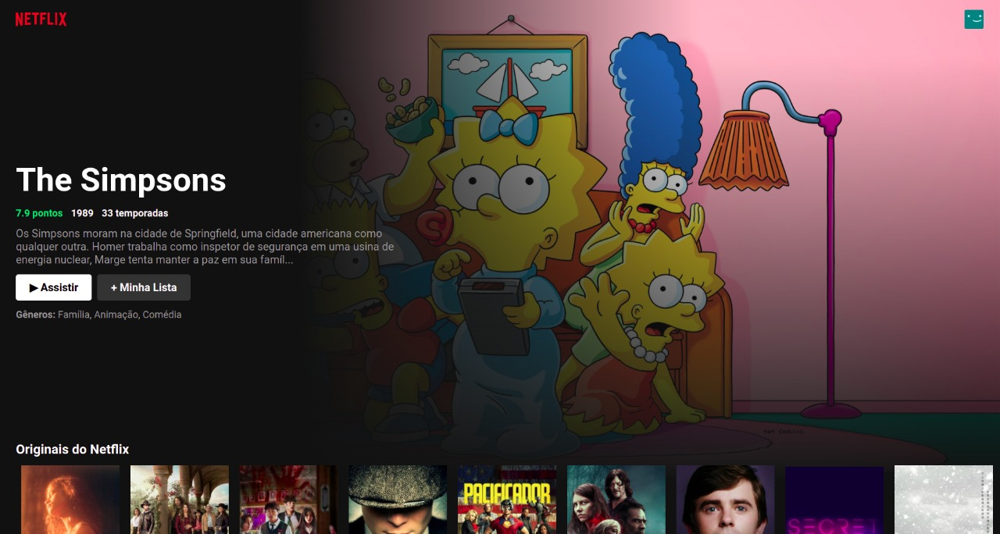
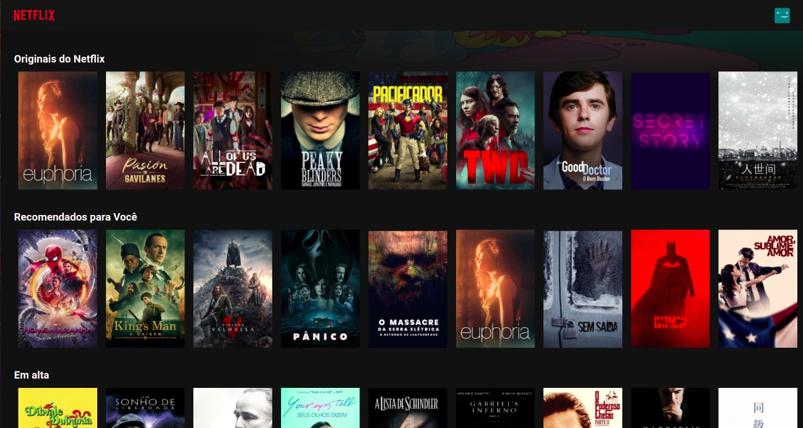
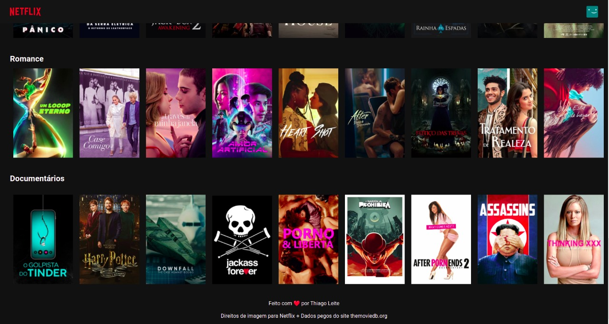

# Clone do Netflix

Para rodar a aplicação, execute os comandos abaixo:

```bash
git clone git@github.com:thiago-henrique-leite/netflix-clone.git

cd netflix-clone/

yarn install

yarn start
```

## Telas da Aplicação






